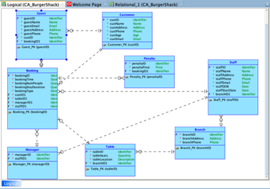
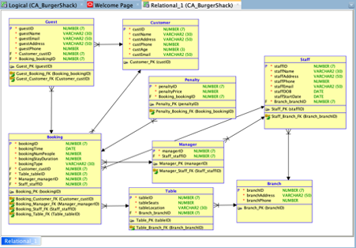
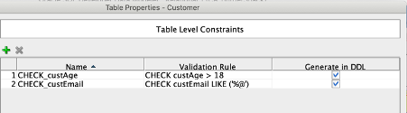
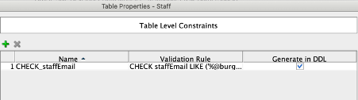
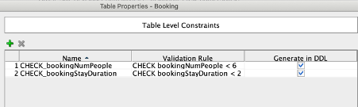
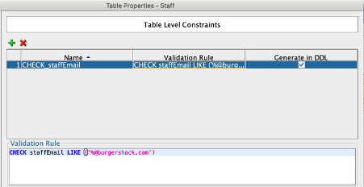
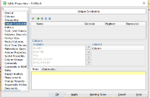

# Restaurant-Database-Project

# Description
For this project, I created the database design suited for this restaurant. I undertook logical and physical data modelling to carry this out. I also built the physical database in Oracle which implements my design that I developed, populated it with data and ran complex queries on it.

I have attached the diagrams i created to design this database below. The code to create and query the database can be found in the sql file. 

# Domain Types

| Domain Type Name	| Type Definition	| Reason Introduced	| Example |
|-------------------|:---------------:|:-----------------:|--------:|
| Address	          | VARCHAR(50)	    | For attributes which represent addresses | staffAddress in entity Staff |
| Age |	NUMERIC(3) | For attributes which represent a persons age |	custAge in entity Customer |
| Quantity |	Numeric(3) |	For attributes which represent a quantity |	bookingNumPeople in entity Booking | 
| Date |	TIMESTAMP WITH LOCAL ZONE |	Date and time attributes which require a very clearly defined time element | staffDOB in entity Staff |
| Email	| VARCHAR(50) |	For attributes which represents emails |	staffEmail in entity Staff |
| Identifier |	NUMERIC(7) |	For attributes which represent unique identifiers |	staffID in entity Staff |
| Name |	VARCHAR(30) |	For attributes which represent names | staffName in entity Staff |
| Phone |	NUMERIC(10) |	For attributes which represents phone numbers |	staffPhone in entity Staff |
| Price |	NUMERIC(2) | For attributes which represent a price	| penaltyPrice in entity Price |

# Major Decisions
When planning the entities, I was unsure how to deal with the customer and guests. My initial thought was to have a table Customer (customerID, custName, custAddress, custEmail, custAge, custPhone) and then have another table Guests (guestID, bookingID [FK] , guestName, guestEmail, guestAddress, guestPhone). 
However. I was trying to figure out if there was any other way to deal with the guests and customers at once as they both share similar data attributes.  However I ended up going forward with my initial plan as I couldn’t think of anything. My thought process behind this was that Customers can have many bookings and tables if they got to the restraint frequently so these attributes wouldn’t make sense to be included in the Customer Table.
The question also says that the guests need to have the table they sat on recorded. By having bookingID as a FK (Booking table will contain TableID as an attribute) this will be possible.

I also had trouble with managers and staff. I was unsure how to corporate a manager and a regular staff member (waiter) to serve each booking. I ended up adding all staff members (including managers) into the staff entity. I then created another entity called Managers, which contained staffID as a foreign key. Only managers were added to this entity. Therefore each manager had both a staffID and a managerID.

# Logical Model Diagram

# Relational Model Diagram

# Constraints

